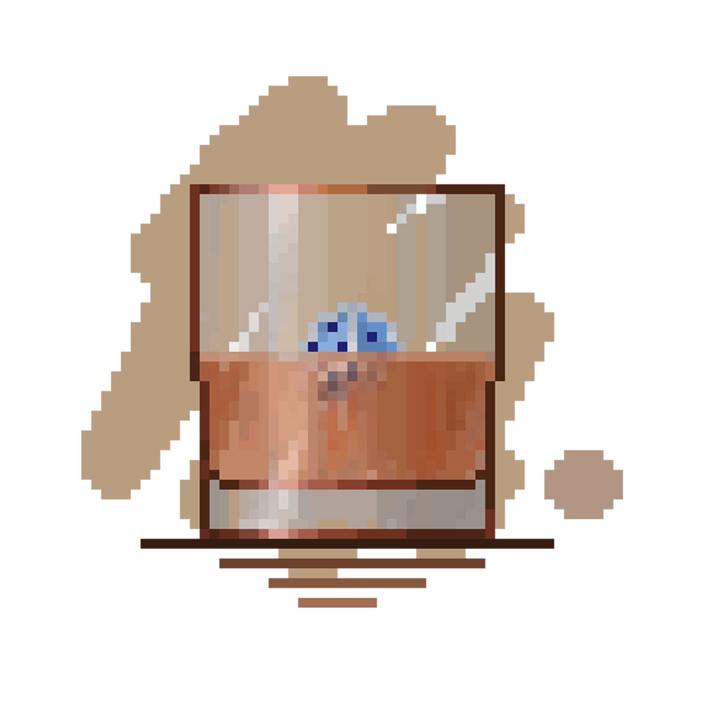

# RumDice

_⚡ 以方便拓展为目标而开发的 原生C# 跑团机器人核心 ⚡_

## 简介
> **这里是朗姆骰，你也可以叫它怪怪骰！**

当前主流的机器人核心框架不能直接进行C#的插件开发，并且想要开发非常复杂的插件功能并不是很好实现。
出于为了给这种状况提供一个解决方案的目的，我开发了此框架。
在这个项目下，你可以用C#非常快捷的进行回复接口声明和编写，也可以用C#、lua等语言作为脚本语言进行外挂插件开发。
同时，我们制作了大量接口以方便插件作者进行自定义操作，包括自定义任意数据类型并利用我们提供的api进行自动的序列化存取。

### 当前开发计划
目前，该库尚未开发完成，我提前发出以记录我的开发过程并邀请广大对C#有热情的跑团人的参加。
在完成该项目的开发之后，我会制作两个基于此框架的机器人“德洛莉丝”和“菲洛米娜”作为示例项目，以便想要搭建自己的骰子的骰主参考或直接使用。
再往后，我会自己实现和gocqhttp的连接-自己完成对mirai的封装-自己实现协议。届时，将有一个完全C#原生的机器人框架。
